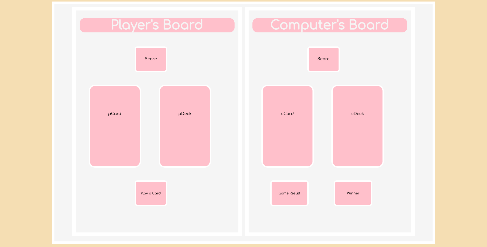

<h1>This is War!<h1>

<h2>A game of 'I Declare War' with a little more pink and fluffiness!<h2>

<!-- ##User Stories

> As a player, I want to be able to start a game.

> As a player, I want to play I Declare War versus a computer.

> As a player, I want to know how many cards are in my hands.

> As a player, I want to be able to keep track of my score.

> As a player, I want to be able to play a card at the same time as the computer.

> As a player, I want the computer to play a card at the same as  the player.

> As a player, I want to know when I or the computer wins.

> As a player, I want to be able to reset the game.

##Psudocode

Page loads

Title and components load 

    >components: title, start button, reset button, player score box, computer score box, players' cards, players' names

Start the game 

    > push the start button and begin the game  
    > score boxes are set to zero
    > shuffle cards
    > deal cards
    > alert the player that the cards are dealt
    > alert the player that the game has begun 

Playing the Game

    > each player reveals a card
    > a comparison is made
    > add cards to winner's deck OR declare war if tied
    > allow the players to keep playing cards until one player's deck is empty

War!

    > alert the player thar war is about to begin
    > push button to declare war
    > count down to one 
    > each player draws three cards but only reveals the last card they drew
    > compare the last cards drawn
    > decide a winner OR if tied, reveal and compare the next card and so on
    > all cards played during war goes to winner
    > alert players' who won the war

Declaring a Winner

    > once a player's deck is empty, alert the opposing player that they won
    > add a point to the winner's score box
    > alert the player that the game is over
    > alert the player to reset the game if they want to play again

Resetting the game (while maintaining score)

    > clear all cards off the board
    > return cards to dealer's deck
    > alert and ask player if they want to reset score
    > do not reset the score boxes  -->