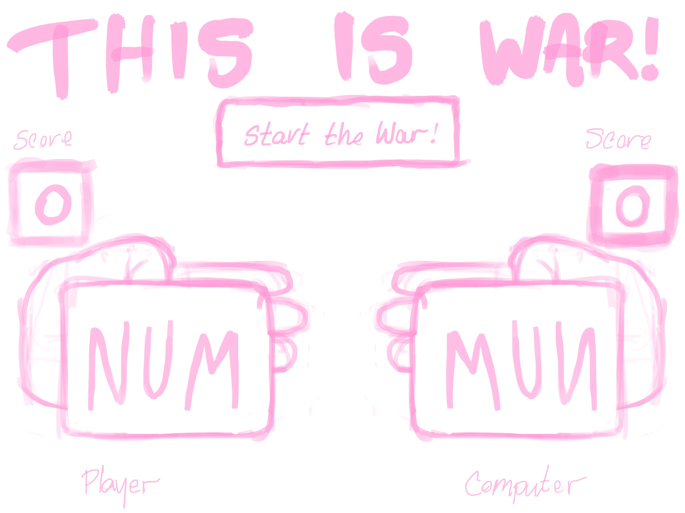

##This is War!

A game of 'I Declare War' with a little more pink and fluffiness!

##User Stories

> As a player, I want to be able to start a game.

> As a player, I want to play I Declare War versus a computer.

> As a player, I want to know how many cards are in my hands.

> As a player, I want to be able to keep track of my score.

> As a player, I want to be able to play a card at the same time as the computer.

> As a player, I want the computer to play a card at the same as  the player.

> As a player, I want to know when I or the computer wins.

> As a player, I want to be able to reset the game.

##Psudocode

> page loads

> title and components load 

    >components: title, start button, reset button, player score box, computer score box, players' cards, players' names

Start the game 

> push the start button and begin the game

    > score boxes are set to zero
    > shuffle cards
    > deal cards
    > alert the player that the cards are dealt
    > alert the player that the game has begun 
    > 

Playing the Game

> 

War!

>

Declaring a Winner

>

Resetting the game (while maintaining score)